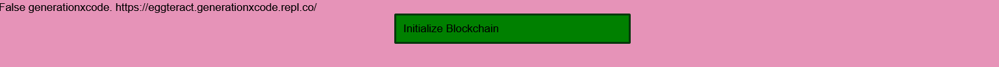
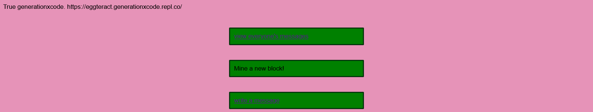
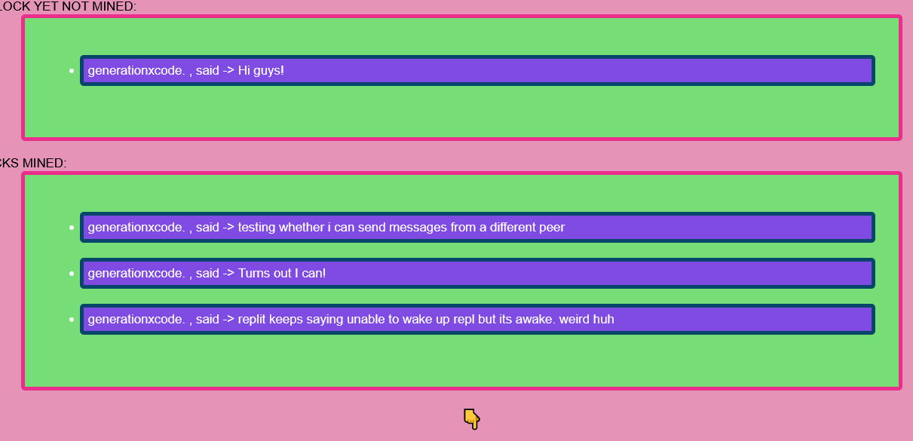

# THIS IS USED IN MY CBSE COMPUTER SCIENCE PROJECT

Below is my attempt to create a decentralized microblogging (like twitter) platform using blockchain technology (same stuff that runs bitcoin). This is again purely for educational use as the proof of work is really easy to solve. This is also probably the last chain I'll make using my own code on replit. I really want to work with something more robust in the future.

This platform is prone to errors, I'm a one man team experimenting with blockchains so it's expected.

**When running the repl, open the webview in a new tab, it most likely wont work if you don't**

Please read the instructions below and I hope you like my creation :)
# Setting up your own peer
* fork this repl on replit.com
* Do **NOT** change the repl name, keep it eggteract (even tho it's not a very cool name)
* run the repl, open the webview on a new tab, like in fullscreen on your browser
* Click on initialize and you're done (no changing json files like i asked on eggcoin)
* 

# Running a peer/ Using the interface

* click on write a message to send a message on the blockchain
* **Everytime you start running your peer, click on initialize, or it wont sync or remove inactive peers**
* 
* You can view the last 6 blocks by clicking on the link on top
* You can mine a new block if you want to start a new block
* I would request you to mine only after there are a certain number of messages on a block, but it's your decision

# What are the benefits of a blockcchain based system that is decentralized?
* I'm not entirely sure. Its a really fun concept to play around with, but i'm still searching and building a comprehensive list of pros and cons of using blockchain systems

# Help needed:
* I need help with the p2p network design, I'd like to limit each peer to a few other peers and the network to be like a mesh. Currently it's not so
* I need help with the HTML and CSS of the webpages. Look at index.html, transactions.html and view_chain.html in egg/templates to help out here.

# Stuff people might notice
* I have another project called `eggnft`, its not really nft but idk. Its a blockchain based videogame. I almost completed it but I was too lazy to make the 3d viewer for the blocks on the browser so thats the only part left. I dont want to complete it either because I don't trust people to use it in a non harmful sfw way.
* A feature that allows people to change their 'network' exists in the code but isnt visible on the UI. This is because I dont trust people to use this feature without doing wrong things. The feature allowed people to create their own blockchain networks.
* I created a cryptocurrency called eggcoin. I didn't write the code for eggcoin properly, I had to rewrite all the blockchain code to make it easier and faster to develop different kinds of blockchains. This one was developed in 3 days with like 1 hour or something put in everyday (took the code from `eggnft` and rewrote large parts). Of course, i wont be using this code again (hopefully).
